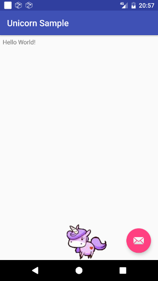
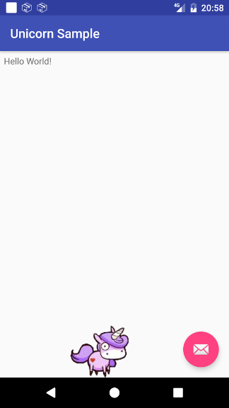
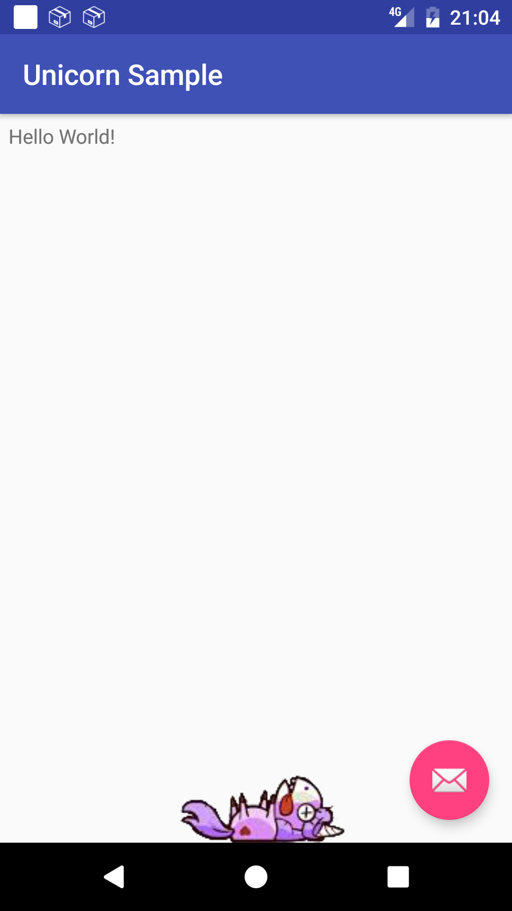

# android-unicorn
A funny Unicorn widget to include in your layouts as a gadget

## Import
On your `build.gradle` add:
```
    repositories {
        maven { url "https://dl.bintray.com/gmazzo/maven/" }
    }

    dependencies {
        compile 'com.github.gmazzo:unicorn:0.1'
    }
```

## Usage
```xml
    <com.github.gmazzo.unicorn.UnicornView
        android:layout_width="match_parent"
        android:layout_height="wrap_content" />
```

## XML attributes
| Attribute | Type | Description | Default value |
| --- | --- | --- | --- |
| `walkSprite` | array (of `Drawable`) | The sprite for *walking* state | `@array/walkSprite`
| `walkSteps` | integer | The number of steps to cover the view's width. A higher number will render a smoother animation | `40`
| `walkInterval` | integer | The interval (in milliseconds) between each image of the sprite (steps) | `200`
| `staringSprite` | array of `Drawable` | The sprite for *staring* state | `@array/staringSprite`
| `staringInterval` | integer | The interval (in milliseconds) between each image of the sprite | `1200`
| `dieClicks` | integer | The number of hits on the view to trigger the die state | `5`
| `dieSprite` | array of `Drawable` | The sprite for *die* state | `@array/dieSprite`
| `dieInterval` | integer | The interval (in milliseconds) between each image of the sprite | `200`
| `showAnimation` | anim | The animation to show when the view becomes visible (may be `null`) | `@null`
| `hideAnimation` | anim | The animation to show when the view becomes invisible (may be `null`) | `@anim/long_slide_down_fade_out`


## Customization
### Change a sprite
On your `values.xml` resource file add:
```xml
    <array name="customSprite">
        <item>@drawable/customSprite1</item>
        <item>@drawable/customSprite2</item>
    </array>
```
and change your `layout` as:
```xml
    <com.github.gmazzo.unicorn.UnicornView
        xmlns:app="http://schemas.android.com/apk/res-auto"
        android:layout_width="match_parent"
        android:layout_height="wrap_content"
        app:walkSprite="@array/customSprite" />
```
Or define a custom `style` as:
```xml
    <style name="UnicornView.Custom">
        <item name="walkSprite">@array/customSprite</item>
    </style>
```
and change your `layout` as:
```xml
    <com.github.gmazzo.unicorn.UnicornView
        style="@style/UnicornView.Custom"
        android:layout_width="match_parent"
        android:layout_height="wrap_content" />
```

## Screenshots



